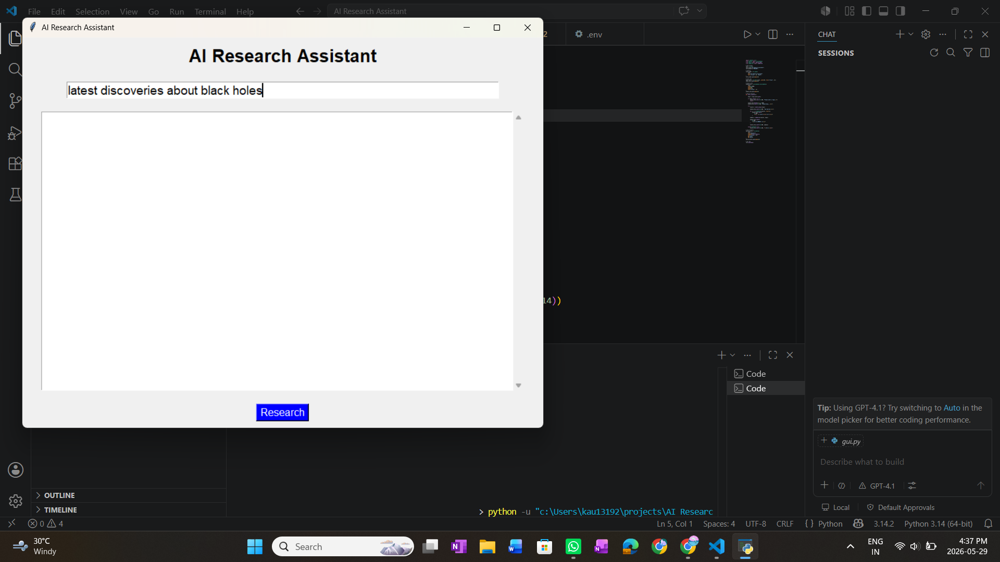
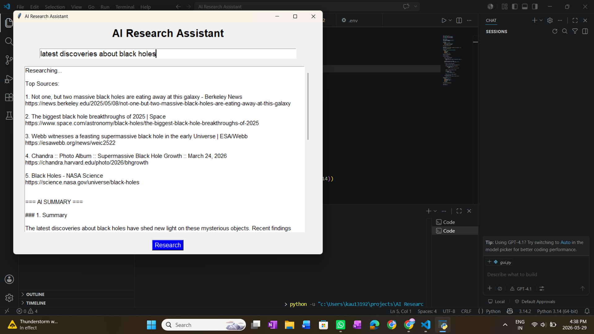

# AI Research Assistant

An AI-powered Research Assistant built using Python, Tavily Search API, Groq LLMs, and Tkinter GUI.

This project searches the web for real-time information and generates concise AI summaries using Large Language Models.

---

# Features

- Real-time web research using Tavily API
- AI-generated summaries using Groq LLM
- Desktop GUI built with Tkinter
- Source citation display
- Clean architecture

---

# Tech Stack

Backend

- Python

APIs

- Tavily API
- Groq API

GUI

- Tkinter

Libraries Used

- tavily-python
- groq
- python-dotenv

---

# How It Works

User Query
    ↓
Tavily Search API
    ↓
Collect Web Sources
    ↓
Groq LLM Summarization
    ↓
Display AI Summary

---

# Code files

---

# GUI Preview

---

# Example Output

---

# Code Explanation

---

# loom video

!
---

Author

Mehakpreet kaur

---

License

This project is open-source and available under the MIT License.
